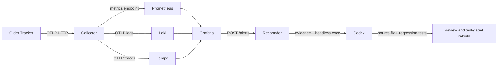

# Order Tracker

A small FastAPI order tracker with OpenTelemetry, a local Grafana stack and an
incident responder that launches Codex when a server-error alert fires.

This is [Homework 4: DevOps and Observability](https://github.com/DataTalksClub/ai-dev-tools-zoomcamp/blob/main/cohorts/2026/homework/04-devops/homework.md)
for AI Dev Tools Zoomcamp 2026, forked from
[alexeygrigorev/order-tracker](https://github.com/alexeygrigorev/order-tracker).
The original UI, API and SQLite storage are preserved.

**[Homework answers and evidence](HOMEWORK.md)** · [Plan](_docs/plan.md) ·
[Backlog](backlog.md) · [Development process](_docs/process.md) · [AI usage](_docs/ai-usage.md)

## Run locally

Requirements: Docker with Compose, Python 3.11+ and [uv](https://docs.astral.sh/uv/).
The automatic responder also needs a working `codex` CLI login on the host.

```bash
uv sync --frozen
docker compose up --build -d --wait
curl http://localhost:8000/healthz
```

| Service | Address |
| --- | --- |
| Order Tracker | http://localhost:8000 |
| API docs | http://localhost:8000/docs |
| Grafana dashboard | http://localhost:3000/d/order-tracker |
| Grafana alert rules | http://localhost:3000/alerting/list |
| Prometheus | http://localhost:9090 |
| Loki | http://localhost:3100/ready |
| Tempo | http://localhost:3200/ready |
| Collector health | http://localhost:13133 |

Grafana's local demo login is `admin` / `admin`; choose Skip when it offers a
password change. Set `GRAFANA_PASSWORD` before first startup to choose another
password. Published ports bind to loopback. If port 8000 is occupied, set
`ORDER_TRACKER_PORT=18080` and use `APP_URL=http://localhost:18080` for the checks.

Orders and telemetry live in named Docker volumes. `docker compose down` keeps
them; adding `-v` deletes this project's stored data. Three orders are seeded
only into an empty database. Use one app container, as in the starter.

## Verify

```bash
make test          # offline API, telemetry, responder and delivery-date tests
make check-app     # real HTTP: health, UI, 200, 404 and ten express lookups
make check-stack   # metrics, logs and traces through Grafana's data sources
```

`check-stack` saves its latest result in `.runtime/stack-check.json`. The
reviewed original homework observations stay in `evidence/`.

## Telemetry



Lookup requests produce `http.server.requests`, a duration histogram, one
structured log and a server span. Metric dimensions include the route template
`/api/orders/{order_id}` and the actual status. Order IDs appear in log/trace
paths, not metric labels. The `x-trace-id` response header connects successful
and missing-order responses to Tempo. Exception logs contain a stack trace and
the same trace ID. No customer names, items or request bodies enter telemetry.

The dashboard shows request totals by status, recent 5xx responses, request
rate and logs. Expand a log row to follow its TraceID link into Tempo.

To reproduce the console-export step:

```bash
TELEMETRY_EXPORTER=console docker compose up -d --wait app
curl http://localhost:8000/api/orders/standard-1001
docker compose logs app
docker compose up -d --wait app   # switch back to OTLP
```

The exporter defaults to `none` outside Compose, keeping offline tests free of
network calls. All SDK providers flush and shut down with the app.

## Alerts and the responder

The provisioned rule evaluates every 10 seconds and fires when the 5xx counter
increases in a two-minute window. There is no pending period. Zero-initialized
counters let a first error be detected after the baseline is scraped. An empty
5xx result becomes zero, and no-data is Normal; query execution failures remain
Error. This rule detects application errors, not missing telemetry or uptime.

The alert contains the endpoint, time window and dashboard link. A notification
policy routes this rule to `http://host.docker.internal:8001/alerts` with a
five-second group wait. Grafana can take about a minute to apply newly
provisioned routing after startup.

Start the host service in another terminal:

```bash
codex login status
make responder
```

The service runs on `127.0.0.1:8001`. Docker Desktop can reach it through
`host.docker.internal`; on a native Linux host, bind it to an interface reachable
from the Compose bridge and restrict access to that bridge. This is a trusted
local demo webhook, without public authentication. Do not expose it publicly.
No Codex credentials are copied into Docker containers or committed.

Send the assignment's test notification:

```bash
curl -X POST http://localhost:8001/alerts \
  -H 'Content-Type: application/json' \
  -d '{"alerts":[{"status":"firing","labels":{"alertname":"ResponderTest","test":"true"},"annotations":{"summary":"Test notification; no incident to fix"}}]}'
```

The response includes an incident ID. Read `.incidents/<id>/status.json` and,
once completed, `response.txt`. Each incident keeps the original webhook,
current metric counters, five minutes of bounded log evidence, up to five
correlated traces and local agent execution output. Collection errors are
recorded in the snapshots. Raw streams and runtime files are ignored by Git.

Resolved notifications are ignored. Matching labels and `startsAt` deduplicate
retries, including after a restart; a new episode has a new `startsAt`. A single
worker serializes agents. Failed/interrupted incidents require investigation
instead of an automatic retry loop. To intentionally repeat the test, supply
a new `startsAt` value.

Codex runs with a read-only sandbox for test alerts and workspace-write for a
real incident. The prompt permits changes only to `app/main.py` and
`tests/test_delivery.py`, requests a regression test first, and forbids commits,
pushes and deployment. This file scope is a prompt constraint, not a filesystem
allowlist; review the diff. Completion of the agent process alone is not proof
that a repair is correct.

Review the fix and deploy only after tests pass:

```bash
git diff
make test
# Commit the reviewed fix, then:
make deploy
```

`make deploy` runs the offline suite before building anything, gives the image a
commit-and-timestamp tag, waits for startup and checks the deployed HTTP API.
A failing test stops the deployment. A failed post-deployment check exits with
an error and needs investigation; automatic rollback is not implemented.

The incident is fixed on `main`, so `express-1002` now returns 200. To repeat
the original exercise, use the pre-fix commit documented in `HOMEWORK.md` in a
separate checkout and Compose project, stopping this stack first to free ports.

## CI

[`.github/workflows/ci.yml`](.github/workflows/ci.yml) runs the offline tests,
then a dependent job builds a uniquely tagged image and verifies the full
Compose stack. Both application HTTP checks and Grafana signal checks must pass.
CI does not launch Codex and requires no model credentials.

## API

| Method | Path | Purpose |
| --- | --- | --- |
| GET | `/` | Web page |
| GET | `/healthz` | Database health check |
| GET | `/api/orders` | List orders |
| POST | `/api/orders` | Create an order |
| GET | `/api/orders/{id}` | Check an order |
| PATCH | `/api/orders/{id}` | Change an order status |
